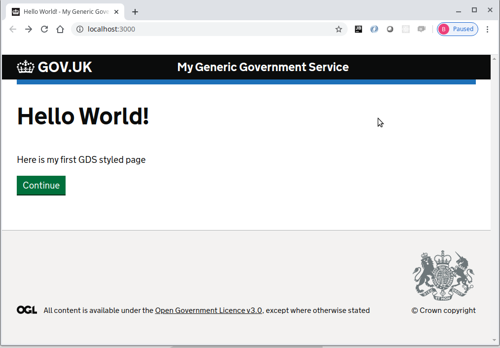
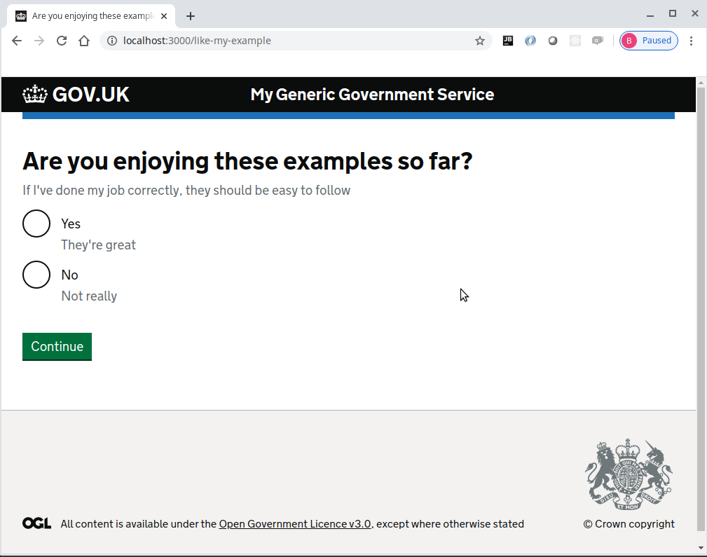
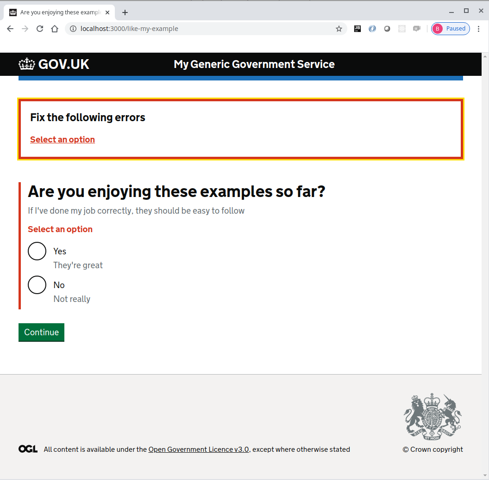
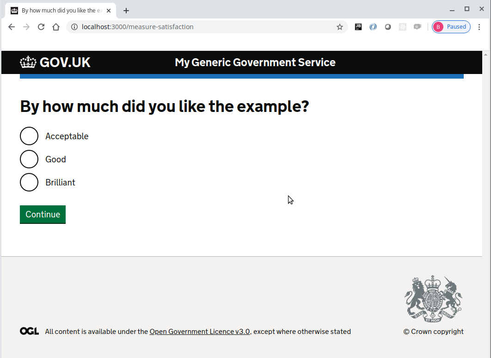

# Form validation example

Form validation adhering to the GOV UK design system is a requirement for all DEFRA services.

The following example will build on the **[logging example](../logging-example/README.md)** and make use of the [@hapi/joi](https://www.npmjs.com/package/@hapi/joi) module to provide standard form validation within a hapi server.

### Install the required modules
Use npm install
```console
foo@bar:~$ npm install @hapi/joi @hapi/hoek
```

Create the following utils/validation.js file with the following
_Please note that if I'd had time, I would have made this a npm module with unit tests etc_
```js
const Hoek = require('@hapi/hoek')
const { logger } = require('defra-logging-facade')

const mapErrorsForDisplay = (details, messages) => {
  return {
    titleText: 'Fix the following errors',
    errorList: details.map(err => {
      const name = err.path[0]
      const message = (messages[name] && messages[name][err.type]) || err.message

      return {
        href: `#${name}`,
        name: name,
        text: message
      }
    })
  }
}

function formatErrors (result, messages) {
  const errorSummary = mapErrorsForDisplay(result.details, messages)
  const errors = {}
  if (errors) {
    errorSummary.errorList.forEach(({ name, text }) => {
      errors[name] = { text }
    })
  }
  const value = result._original || {}
  return { value, errorSummary, errors }
}

module.exports = (view, viewData, messages = {}) => async function (request, h, errors) {
  // If any of the viewData properties are a function, execute it and return the result
  await Promise.all(Object.entries(viewData).map(async ([prop, val]) => {
    if (typeof val === 'function') {
      try {
        viewData[prop] = await val(request)
      } catch (e) {
        logger.error(`viewData['${prop}'] failed as a function with: `, e)
      }
    }
  }))

  // Merge the viewData with the formatted error messages
  Hoek.merge(viewData, await formatErrors(errors, messages), { mergeArrays: false })

  return h.view(view, viewData)
    .code(400)
    .takeover()
}

module.exports.formatErrors = formatErrors
```

Edit the modules/form-layout.njk to include the error summary using the [govukErrorSummary](https://design-system.service.gov.uk/components/error-summary/) macro as follows:
```twig





    
        {{ govukErrorSummary(errorSummary) }}
    

    <form method="post" autocomplete="off" novalidate>
        
        

        {{ govukButton({
            text: "Continue"
        }) }}
    </form>

```

Edit the modules/question/question.njk to include the errorMessage
```twig





    {{ govukRadios({
        idPrefix: "answer",
        name: "answer",
        fieldset: {
            legend: {
                text: pageHeading,
                isPageHeading: true,
                classes: "govuk-fieldset__legend--l"
            }
        },
        hint: hint,
        errorMessage: errors['answer'],
        items: items
    }) }}

```

Now, using [@hapi/joi](https://www.npmjs.com/package/@hapi/joi), configure the fail action and validation options in the route modules/question/question.route.js
```js
'use strict'

const Joi = require('@hapi/joi')
const { failWith } = require('../../utils/validation')
const { setQueryData, getQueryData, getCurrent } = require('@envage/hapi-govuk-journey-map')
const view = 'question/question'

function getOptions (request) {
  const route = getCurrent(request)
  const { options } = route.parent
  return options
}

function getPageHeading (request) {
  const { questionHeading } = getOptions(request)
  return questionHeading
}

function getHint (request) {
  const { hint } = getOptions(request)
  return { text: hint }
}

function getItems (request) {
  const { items, answerProperty } = getOptions(request)
  const queryData = getQueryData(request)
  return items.map(({ value, text, hint }) => {
    return {
      value,
      text,
      hint: { text: hint },
      checked: queryData[answerProperty] === String(value)
    }
  })
}

module.exports = [{
  method: 'GET',
  handler: (request, h) => {
    return h.view(view, {
      pageHeading: getPageHeading(request),
      hint: getHint(request),
      items: getItems(request)
    })
  }
}, {
  method: 'POST',
  handler: async (request, h) => {
    const { answerProperty, commentProperty } = getOptions(request)
    const queryData = getQueryData(request)
    const { answer } = request.payload
    const commentRequired = commentProperty && answer !== 'yes'
    await setQueryData(request, {
      answer,
      commentRequired: commentRequired ? 'yes' : 'no',
      [commentProperty]: commentRequired ? queryData[commentProperty] : undefined,
      [answerProperty]: answer
    })
    return h.continue
  },
  options: {
    validate: {
      payload: Joi.object({
        answer: Joi.string().trim().required()
      }),
      failAction: failWith(view,
        { pageHeading: getPageHeading, hint: getHint, items: getItems }, {
          answer: {
            'any.required': 'Select an option'
          }
        })
    }
  }
}]
```

Make sure all the javascript files are formatted correctly using standard
```console
foo@bar:~$ npx standard --fix
```

### Make sure the application now works as expected

Now start the server
```console
foo@bar:~$ npm start
```

The browser should display the following web page with the continue button



Pressing the continue button should display the question page with two radio buttons and a continue button



When continue is clicked without selecting any option, errors are displayed in the same page



When "Yes" is selected and continue is clicked, the satisfaction page is displayed as the validation has been successful



### Completed Form validation example
If all the steps above, have been followed correctly, the project should contain the files found [here](.)

For more extensive usage of this method of validation, take a look at the **poc_flow_map_front_end** project within the [The Permiting POC](https://github.com/DEFRA/permit-poc)

## Other essential plugins
Continue with the [other essential plugins](../README.md)
