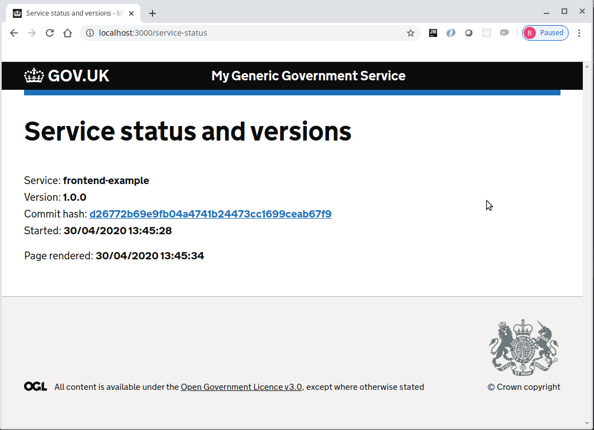

# Service status example

Implementing a service status page makes it easy to determine the status and version of the service.

The following example will build on the [journey map examples](../../journey-map-examples/README.md) and make use of the [defra-logging-facade](https://github.com/DEFRA/defra-logging-facade) plugin to provide a simple way to configure the logging in a hapi server.

### Install the plugin
Use npm install
```console
foo@bar:~$ npm install hapi-version-status
```

Update the package.json file to make sure the homepage property exists as this is used 
to locate the commit hash for the latest commit.
```json
{
  "name": "frontend-example",
  "version": "1.0.0",
  "description": "",
  "main": "index.js",
  "homepage": "https://github.com/DEFRA/hapi-govuk-examples#readme",
  "scripts": {
    "start": "node index.js",
    "postinstall": "npx node-sass --output-style=expanded --output=public/build/stylesheets application.scss"
  },
  "author": "",
  "license": "ISC",
  "dependencies": {
    "@envage/hapi-govuk-frontend": "^0.2.1",
    "@envage/hapi-govuk-journey-map": "^0.1.1",
    "@hapi/hapi": "^19.1.1",
    "govuk-frontend": "^3.6.0",
    "hapi-version-status": "^2.0.1",
    "nunjucks": "^3.2.1"
  },
  "devDependencies": {
    "node-sass": "^4.13.1",
    "standard": "^14.3.3"
  }
}
```

Create the new plugin plugins/service-status.plugin.js
```js
module.exports = {
  plugin: require('hapi-version-status'),
  options: {
    path: '/service-status',
    view: 'service-status',
    viewData: {
      pageHeading: 'Service status and versions'
    }
  }
}
```

Edit the index.js file to register the service status plugin
```js
'use strict'

const Hapi = require('@hapi/hapi')

const init = async () => {
  const server = Hapi.server({
    port: 3000,
    host: 'localhost'
  })

  await server.register(require('./plugins/frontend.plugin'))
  await server.register(require('./plugins/service-status.plugin'))
  await server.register(require('./plugins/journey-map.plugin'))
  await server.start()

  console.log('Server running on %s', server.info.uri)
}

process.on('unhandledRejection', (err) => {
  console.log(err)
  process.exit(1)
})

init()
```

Add the view modules/service-status.njk
```twig



    <h1 class="govuk-heading-xl">{{ pageHeading }}</h1>
    
        <ul class="govuk-list">
            <li>
                <label>Service:</label>
                <strong id="application-service-{{ service.name }}">{{ service.name }}</strong>
            </li>
            <li>
                <label>Version:</label>
                <strong id="application-version-{{ service.name }}">{{ service.version }}</strong>
            </li>
            <li>
                <label>Commit hash:</label>
                <strong>
                    <a id="commit-hash-{{ service.name }}" target="_blank" class="govuk-link"
                       href="{{ service.commit }}">{{ service.hash }}</a>
                </strong>
            </li>
            <li>
                <label>Started:</label>
                <strong>{{ service.started }}</strong>
            </li>
        </ul>
    

    <ul class="govuk-list">
        <li>
            <label>Page rendered:</label>
            <strong>{{ rendered }}</strong>
        </li>
    </ul>

```

Make sure all the javascript files are formatted correctly using standard
```console
foo@bar:~$ npx standard --fix
```

### Make sure the application now works as expected

Now start the server
```console
foo@bar:~$ npm start
```

In the browser load the page localhost:3000/service-status to see following



### Completed service status example
If all the steps above, have been followed correctly, the project should contain the files found [here](.)

## Other essential plugins
Continue with the [other essential plugins](../README.md)
