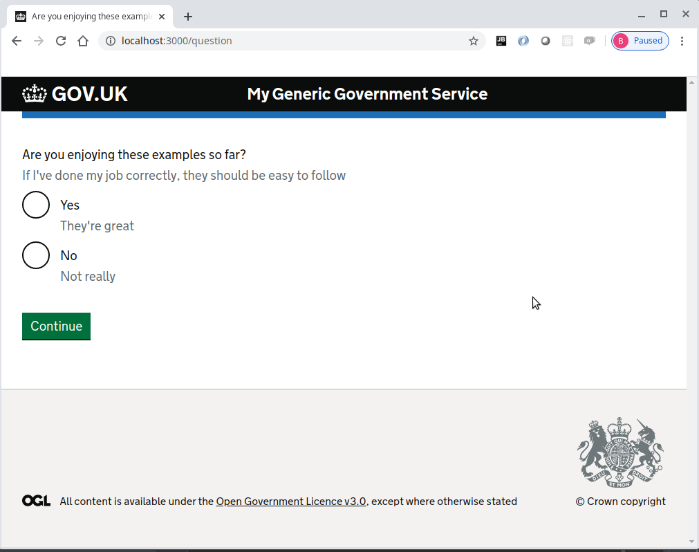

# Journey map example part 3
Please note that this continues with the project built within [part 2](../journey-map-example-2/README.md)

## Add the completed page 
The completed page will display the answer from the question page.

Create the views/completed.njk file with the following:
```twig






    {{ govukPanel({
        titleText: pageHeading,
        html: details
    }) }}


```

Create the routes/completed.route.js file with the following content:
```js
'use strict'

const path = '/completed'

module.exports = {
  method: 'GET',
  path,
  handler: (request, h) => {
    const { answer } = request.query
    return h.view('completed', {
      pageHeading: 'Example complete',
      details: `You chose<br><strong>${answer}</strong>`
    })
  }
}
```

Register the completed route in the index.js file
```js
'use strict'

const Hapi = require('@hapi/hapi')

const init = async () => {
  const server = Hapi.server({
    port: 3000,
    host: 'localhost'
  })

  await server.register(require('./plugins/frontend.plugin'))
  await server.route(require('./routes/home.route'))
  await server.route(require('./routes/question.route'))
  await server.route(require('./routes/completed.route'))
  await server.start()

  console.log('Server running on %s', server.info.uri)
}

process.on('unhandledRejection', (err) => {
  console.log(err)
  process.exit(1)
})

init()
``` 

Make sure all the javascript files are formatted correctly using standard
```console
foo@bar:~$ npx standard --fix
```

Now start the server
```console
foo@bar:~$ npm start
```

The browser should display the following web page with the continue button


Pressing the continue button should display the question page with two radio buttons and a continue button



When "Yes" is selected and continue is clicked, the completed page is displayed with the answer from the question page


### Completed journey-map-example part 3
If all the steps above, have been followed correctly, the project should contain the files found [here](.)

## Journey map example part 4
Continue with [part 4](../journey-map-example-4/README.md)