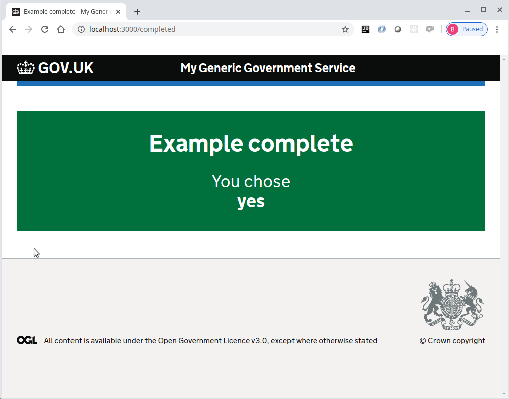

# Journey map example part 4
Please note that this continues with the project built within [part 3](../journey-map-example-3/README.md)

At this point we will introduce the [@envage/hapi-govuk-journey-map](https://www.npmjs.com/package/@envage/hapi-govuk-journey-map) plugin

Install the dependency using npm
```console
foo@bar:~$ npm install @envage/hapi-govuk-journey-map
```

Output the contents of the newly created and updated package.json file
```console
foo@bar:~$ cat package.json
```

The expected output should be something like:
```json
{
  "name": "frontend-example",
  "version": "1.0.0",
  "description": "",
  "main": "index.js",
  "scripts": {
    "start": "node index.js",
    "postinstall": "npx node-sass --output-style=expanded --output=public/build/stylesheets application.scss"
  },
  "author": "",
  "license": "ISC",
  "dependencies": {
    "@envage/hapi-govuk-frontend": "^0.2.1",
    "@envage/hapi-govuk-journey-map": "^0.1.0",
    "@hapi/hapi": "^19.1.1",
    "govuk-frontend": "^3.6.0",
    "nunjucks": "^3.2.1"
  },
  "devDependencies": {
    "node-sass": "^4.13.1",
    "standard": "^14.3.3"
  }
}
```
## Converting the project to use the journey map plugin
Create a new modules folder and move both the routes and views into it
```console
foo@bar:~$ mkdir modules
foo@bar:~$ mv routes/*.* modules
foo@bar:~$ mv views/*.* modules
foo@bar:~$ rmdir routes
foo@bar:~$ rmdir views
```

Edit the front-end plugin to match the new location of the views
```js
'use strict'

const pkg = require('../package.json')

module.exports = {
  plugin: require('@envage/hapi-govuk-frontend'),
  options: {
    assetPath: '/assets',
    assetDirectories: ['public/static', 'public/build'],
    serviceName: 'My Generic Government Service',
    viewPath: 'modules',
    includePaths: [],
    context: {
      appVersion: pkg.version
    }
  }
}
```

Create the new journey map file in the modules folder as map.yml
```yaml
home:
  path: /
  route: home.route

question:
  path: /question
  route: question.route

completed:
  path: /completed
  route: completed.route
```

Create the new plugin plugins/journey-map.plugin.js
```js
const cache = {}

const { resolve } = require('path')

module.exports = {
  plugin: require('@envage/hapi-govuk-journey-map'),
  options: {
    modulePath: resolve(`${process.cwd()}/modules`),
    setQueryData: (request, data) => {
      Object.assign(cache, data)
    },
    getQueryData: (request) => {
      return { ...cache }
    },
    journeyMapPath: '/journey-map'
  }
}
```

Edit the index.js file to replace registering the routes with registering the plugin
```js
'use strict'

const Hapi = require('@hapi/hapi')

const init = async () => {
  const server = Hapi.server({
    port: 3000,
    host: 'localhost'
  })

  await server.register(require('./plugins/frontend.plugin'))
  await server.register(require('./plugins/journey-map.plugin'))
  await server.start()

  console.log('Server running on %s', server.info.uri)
}

process.on('unhandledRejection', (err) => {
  console.log(err)
  process.exit(1)
})

init()
```

Remove the path from all the routes as they are assigned within the map.yml file.
Change the "h.redirect" statements in all the routes to "h.continue" so that the plugin handles the redirection.
Store and recover the answer to the question using a query-data cache with the setQueryData and getQueryData functions.

- home.route.js
    ```js
    'use strict'
        
    module.exports = [{
      method: 'GET',
      handler: (request, h) => h.view('home', {
        pageHeading: 'Hello World!',
        pageText: 'Here is my first GOV.UK Design System styled page'
      })
    }, {
      method: 'POST',
      handler: (request, h) => h.continue
    }]
    ```
- question.route.js
    ```js
    'use strict'
    
    const { setQueryData, getQueryData } = require('@envage/hapi-govuk-journey-map')
    
    module.exports = [{
      method: 'GET',
      handler: (request, h) => {
        const { answer } = getQueryData(request)
        return h.view('question', {
          pageHeading: 'Are you enjoying these examples so far?',
          hint: { text: 'If I\'ve done my job correctly, they should be easy to follow' },
          items: [
            {
              value: 'yes',
              text: 'Yes',
              hint: { text: 'They\'re great' },
              checked: answer === 'yes'
            },
            {
              value: 'no',
              text: 'No',
              hint: { text: 'Not really' },
              checked: answer === 'no'
            }
          ]
        })
      }
    }, {
      method: 'POST',
      handler: async (request, h) => {
        const { answer } = request.payload
        await setQueryData(request, { answer })
        return h.continue
      }
    }]

    ```
- completed.route.js
    ```js
    'use strict'
    
    const { getQueryData } = require('@envage/hapi-govuk-journey-map')
    
    module.exports = {
      method: 'GET',
      handler: async (request, h) => {
        const { answer } = await getQueryData(request)
        return h.view('completed', {
          pageHeading: 'Example complete',
          details: `You chose<br><strong>${answer}</strong>`
        })
      }
    }

    ```


Make sure all the javascript files are formatted correctly using standard
```console
foo@bar:~$ npx standard --fix
```

### Make sure the application now works as expected

Now start the server
```console
foo@bar:~$ npm start
```

The browser should display the following web page with the continue button


Pressing the continue button should display the question page with two radio buttons and a continue button


When "Yes" is selected and continue is clicked, the completed page is displayed with the answer from the question page



### Completed journey-map-example part 4
If all the steps above, have been followed correctly, the project should contain the files found [here](.)

## Journey map example part 5
Continue with [part 5](../journey-map-example-5/README.md)