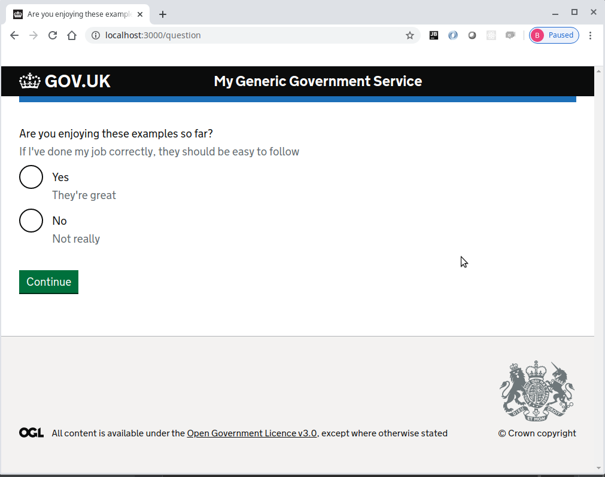
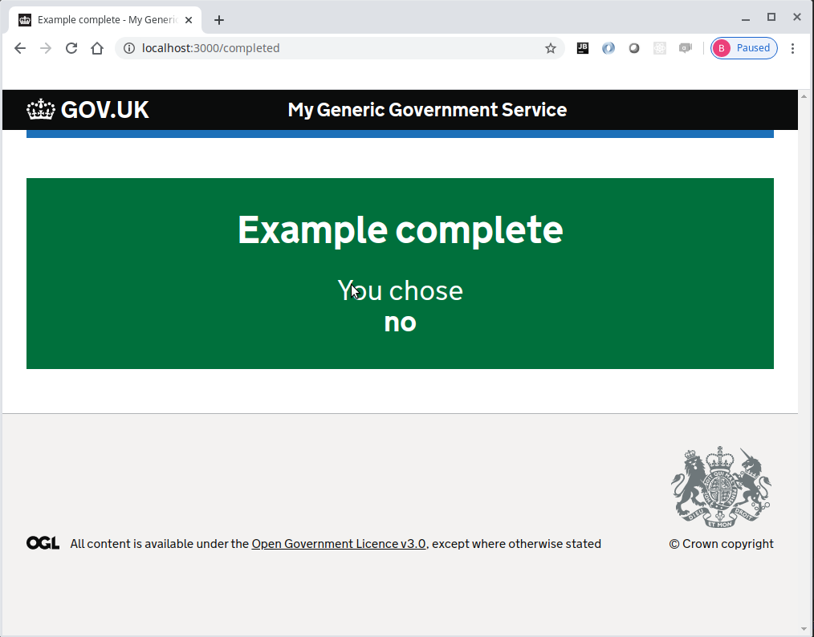

# Journey map example part 5
Please note that this continues with the project built within [part 4](../journey-map-example-4/README.md)

At this point we will introduce branching to allow the service to navigate through an alternative path

Create the new route file modules/apology.route.js
```js
'use strict'

module.exports = [{
  method: 'GET',
  handler: async (request, h) => {
    return h.view('apology', {
      pageHeading: 'Apology',
      pageText: 'I\'m sorry you don\'t like my example'
    })
  }
}, {
  method: 'POST',
  handler: (request, h) => h.continue
}]
```

Create the new view file modules/apology.njk
```twig





    <form method="post" autocomplete="off" novalidate>
        <h1 class="govuk-heading-xl">{{ pageHeading }}</h1>
        <p class="govuk-body">{{ pageText }}</p>

        {{ govukButton({
            text: "Continue"
        }) }}
    </form>

```

Now add the apology route to modules/map.yml
```yaml
home:
  path: /
  route: home.route

question:
  path: /question
  route: question.route
  next:
    query: answer
    when:
      yes: completed
      no: apology

apology:
  path: /apology
  route: apology.route

completed:
  path: /completed
  route: completed.route
```

Make sure all the javascript files are formatted correctly using standard
```console
foo@bar:~$ npx standard --fix
```

### Make sure the application now works as expected

Now start the server
```console
foo@bar:~$ npm start
```

The browser should display the following web page with the continue button


Pressing the continue button should display the question page with two radio buttons and a continue button



When "Yes" is selected and continue is clicked, the completed page is displayed with the answer from the question page


Now press the browser button back to return to the question page and select "No".  
This time when continue is clicked, the apology page is displayed.


Pressing the continue button should display the completed page with "no" as the answer



### Completed journey-map-example part 5
If all the steps above, have been followed correctly, the project should contain the files found [here](.)

## Journey map example part 6
Continue with [part 6](../journey-map-example-6/README.md)