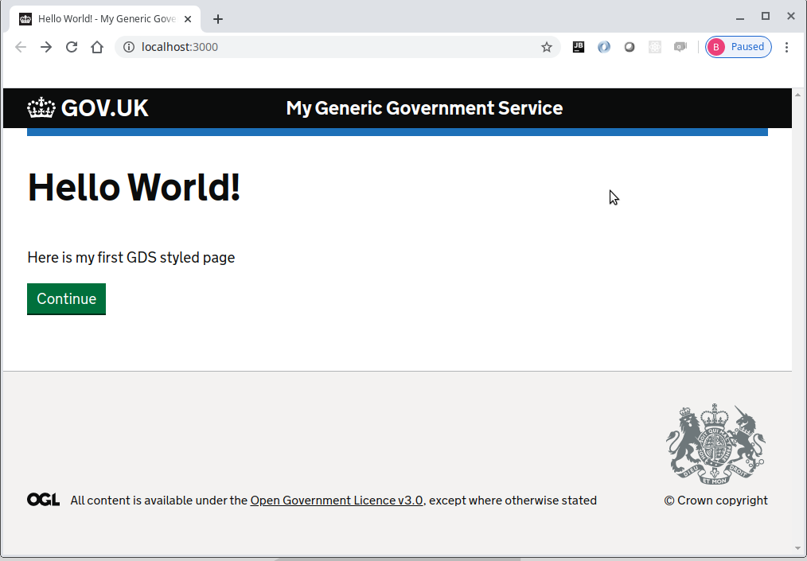
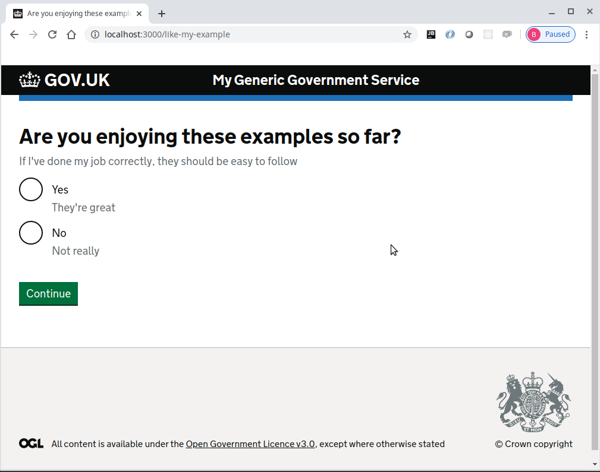
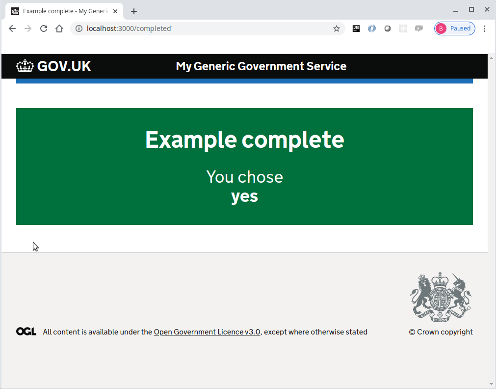
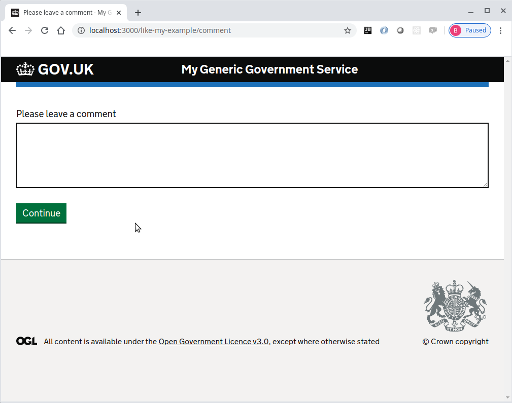
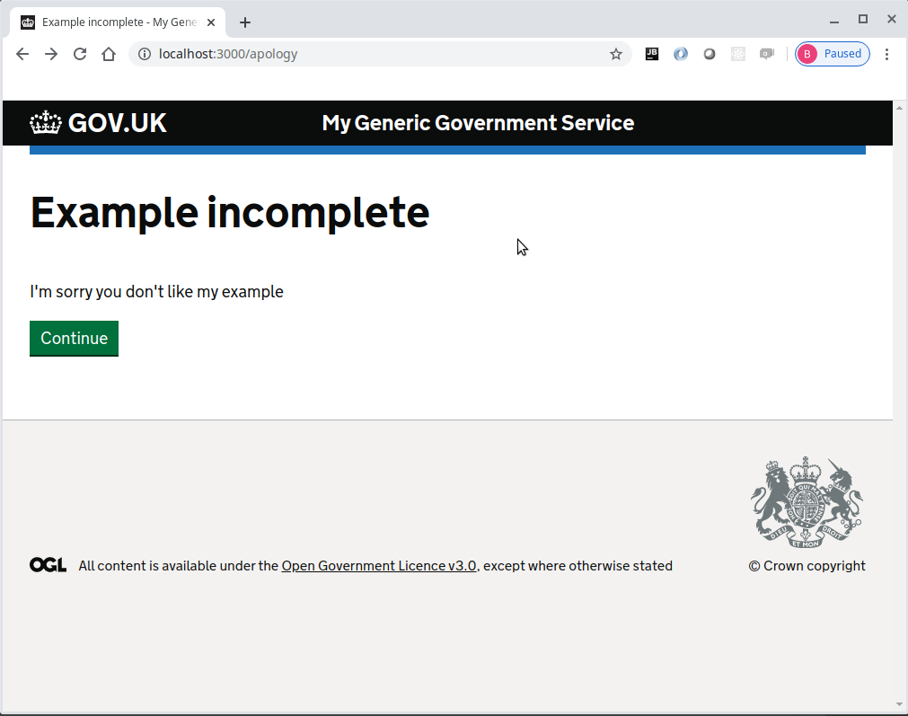
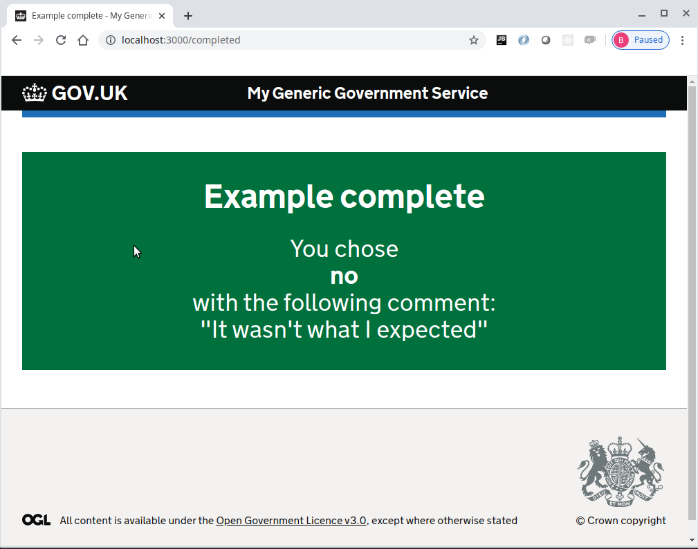

# Journey map example part 6
Please note that this continues with the project built within [part 5](../journey-map-example-5/README.md)

At this point we will introduce a module to allow the question route and view to be reused along with an additional route
for the comment to be entered if the answer to the question was 'no'

## Create the question module

Create the new question module folder
```console
foo@bar:~$ mkdir modules/question
```

Move the question route and view into the question module folder
```console
foo@bar:~$ mv modules/question*.* modules/question
```

Create the new question map file modules/question/question.map.yml
```yaml
question:
  route: question.route
  next:
    query: answer
    when:
      yes: return
      no: comment

comment:
  path: /comment
  route: comment.route
```

Create the new route modules/question/comment.route.js
```js
'use strict'

const { setQueryData, getQueryData } = require('@envage/hapi-govuk-journey-map')

module.exports = [{
  method: 'GET',
  handler: (request, h) => {
    const { comment } = getQueryData(request)
    return h.view('question/comment', {
      pageHeading: 'Please leave a comment',
      comment: comment
    })
  }
}, {
  method: 'POST',
  handler: async (request, h) => {
    const { comment } = request.payload
    await setQueryData(request, { comment })
    return h.continue
  }
}]
```

Create the new view file modules/question/comment.njk
```twig






    <form method="post" autocomplete="off" novalidate>
        {{ govukTextarea({
            name: "comment",
            id: "comment",
            label: {
                text: pageHeading,
                isPageHeading: true,
                classes: "govuk-fieldset__legend--l"
            },
            value: comment
        }) }}

        {{ govukButton({
            text: "Continue"
        }) }}
    </form>

```

Edit modules/completed.route.js to include the comment in the details if 'yes' was not the answer
```js
'use strict'

const { getQueryData } = require('@envage/hapi-govuk-journey-map')

module.exports = {
  method: 'GET',
  handler: async (request, h) => {
    const { answer, comment } = await getQueryData(request)
    const commentDetail = answer !== 'yes' && comment ? `<br>with the following comment:<br>"${comment}"` : ''
    return h.view('completed', {
      pageHeading: 'Example complete',
      details: `You chose<br><strong>${answer}</strong>${commentDetail}`
    })
  }
}
```

Now replace the question with a question module in the modules/map.yml
```yaml
home:
  path: /
  route: home.route

question:
  path: /question
  route: question.route
  next:
    query: answer
    when:
      yes: completed
      no: apology

apology:
  path: /apology
  route: apology.route

completed:
  path: /completed
  route: completed.route
```

Make sure all the javascript files are formatted correctly using standard
```console
foo@bar:~$ npx standard --fix
```

Now start the server
```console
foo@bar:~$ npm start
```

The browser should display the following web page with the continue button



Pressing the continue button should display the question page with two radio buttons and a continue button



When "Yes" is selected and continue is clicked, the completed page is displayed with the answer from the question page



Now press the browser button back to return to the question page and select "No".  
This time when continue is clicked, the comment page is displayed.



Enter a comment and when continue is clicked, the apology page is displayed



Pressing the continue button should display the completed page with "no" as the answer including a comment



### Completed journey-map-example part 6
If all the steps above, have been followed correctly, the project should contain the files found [here](.)

## Journey map example part 7
Continue with [part 7](../journey-map-example-7/README.md)