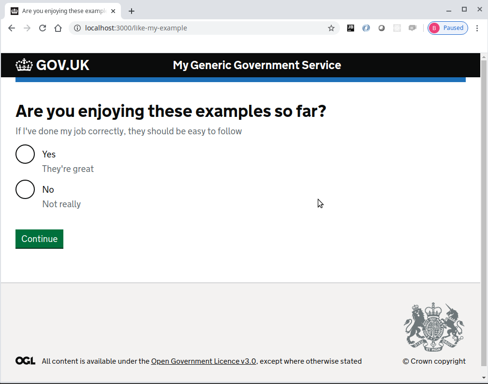
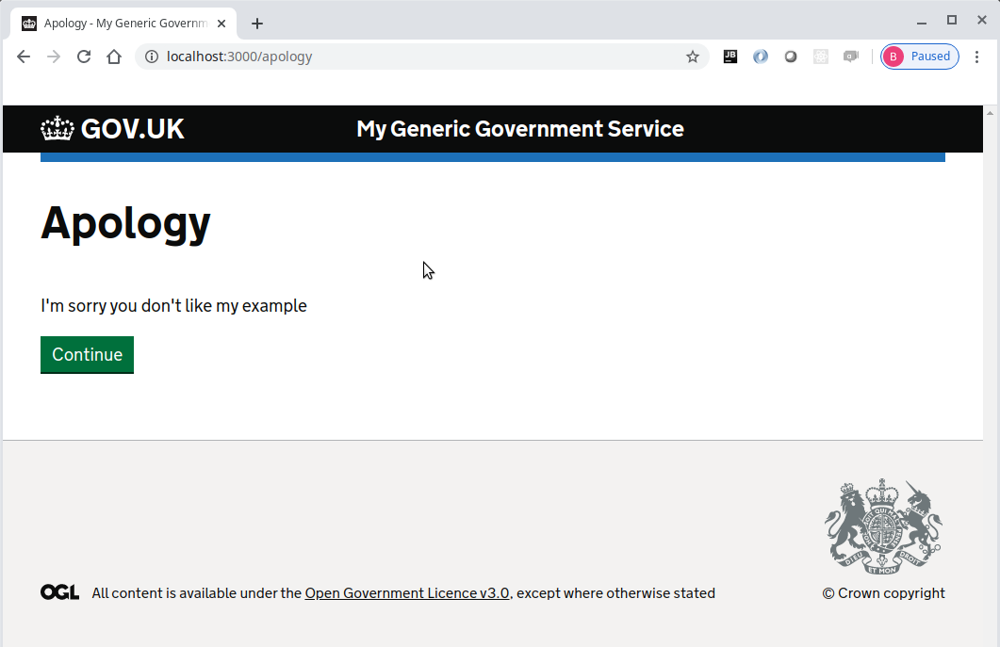

# Journey map example part 7
Please note that this continues with the project built within [part 6](../journey-map-example-6/README.md)

In order for a module to be totally reusable, parameters need to be passed in.  
The question module will be generalised and in [part 8](../journey-map-example-8/README.md)
two more questions re-using the question module will be introduced.

## Add options when registering the module within the map modules/map.yml

Now edit the question module in the modules/map.yml to include some options
```yaml
home:
  path: /
  route: home.route

like-my-example:
  path: /like-my-example
  module: question
  options:
    questionHeading: Are you enjoying these examples so far?
    answerProperty: likeMyExample
    hint: If I've done my job correctly, they should be easy to follow
    items:
      - value: yes
        text: Yes
        hint: They're great
      - value: no
        text: No
        hint: Not really
    commentHeading: Please leave a comment
    commentProperty: likeMyExampleComment
  next:
    query: likeMyExample
    when:
      yes: completed
      no: apology

apology:
  path: /apology
  route: apology.route

completed:
  path: /completed
  route: completed.route
```

The edit the mapping for the question module modules/question/question.map.yml
```yaml
question:
  route: question.route
  next:
    query: commentRequired
    when:
      yes: comment
      no: return

comment:
  path: /comment
  route: comment.route
```

Edit the route file modules/question/question.route.js so that it uses the options.
Note that we will be using getCurrent to get the current route definition, and the parent 
property to access the options.
```js
'use strict'

const { setQueryData, getQueryData, getCurrent } = require('@envage/hapi-govuk-journey-map')

function getOptions (request) {
  const route = getCurrent(request)
  const { options } = route.parent
  return options
}

module.exports = [{
  method: 'GET',
  handler: (request, h) => {
    const { questionHeading, answerProperty, hint, items } = getOptions(request)
    const queryData = getQueryData(request)
    return h.view('question/question', {
      pageHeading: questionHeading,
      hint: { text: hint },
      items: items.map(({ value, text, hint }) => {
        return {
          value,
          text,
          hint: { text: hint },
          checked: queryData[answerProperty] === String(value)
        }
      })
    })
  }
}, {
  method: 'POST',
  handler: async (request, h) => {
    const { answerProperty, commentProperty } = getOptions(request)
    const queryData = getQueryData(request)
    const { answer } = request.payload
    const commentRequired = commentProperty && answer !== 'yes'
    await setQueryData(request, {
      answer,
      commentRequired: commentRequired ? 'yes' : 'no',
      [commentProperty]: commentRequired ? queryData[commentProperty] : undefined,
      [answerProperty]: answer
    })
    return h.continue
  }
}]
```

Edit the route file modules/question/comment.route.js so that it also uses the options.
```js
'use strict'

const { setQueryData, getQueryData, getCurrent } = require('@envage/hapi-govuk-journey-map')

function getOptions (request) {
  const route = getCurrent(request)
  const { options } = route.parent
  return options
}

module.exports = [{
  method: 'GET',
  handler: (request, h) => {
    const { commentHeading, commentProperty } = getOptions(request)
    const queryData = getQueryData(request)
    return h.view('question/comment', {
      pageHeading: commentHeading,
      comment: queryData[commentProperty]
    })
  }
}, {
  method: 'POST',
  handler: async (request, h) => {
    const { commentProperty } = getOptions(request)
    const { comment } = request.payload
    setQueryData(request, { [commentProperty]: comment })
    return h.continue
  }
}]
```

Edit the route file modules/completed.route.js to use the correct comment property
```js
'use strict'

const { getQueryData } = require('@envage/hapi-govuk-journey-map')

module.exports = {
  method: 'GET',
  handler: async (request, h) => {
    const { likeMyExample: answer, likeMyExampleComment: comment } = await getQueryData(request)
    const commentDetail = comment ? `<br>with the following comment:<br>"${comment}"` : ''
    return h.view('completed', {
      pageHeading: 'Example complete',
      details: `You chose<br><strong>${answer}</strong>${commentDetail}`
    })
  }
}
```

Make sure all the javascript files are formatted correctly using standard
```console
foo@bar:~$ npx standard --fix
```

### Make sure the application now works as expected

Now start the server
```console
foo@bar:~$ npm start
```

The browser should display the following web page with the continue button


Pressing the continue button should display the question page with two radio buttons and a continue button



When "Yes" is selected and continue is clicked, the completed page is displayed with the answer from the question page


Now press the browser button back to return to the question page and select "No".  
This time when continue is clicked, the comment page is displayed.


Enter a comment and when continue is clicked, the apology page is displayed



Pressing the continue button should display the completed page with "no" as the answer including a comment


### Completed journey-map-example part 7
If all the steps above, have been followed correctly, the project should contain the files found [here](.)

## Journey map example part 8
Continue with [part 8](../journey-map-example-8/README.md)


