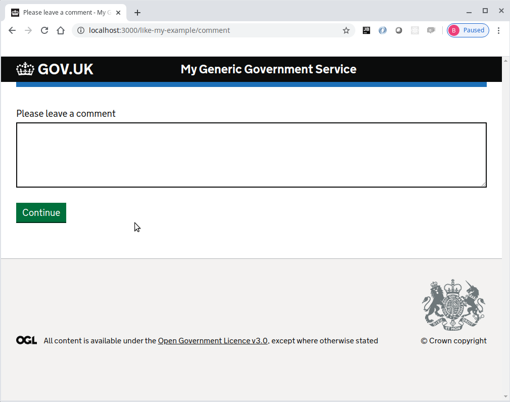

# Journey map example part 8
Please note that this continues with the project built within [part 7](../journey-map-example-7/README.md)

Now the module is reusable, we will be adding two more questions using the same question module.

## Create two new questions within the journey

Now edit the question module in the modules/map.yml to include the new questions
```yaml
home:
  path: /
  route: home.route

like-my-example:
  path: /like-my-example
  module: question
  options:
    questionHeading: Are you enjoying these examples so far?
    answerProperty: likeMyExample
    hint: If I've done my job correctly, they should be easy to follow
    items:
      - value: yes
        text: Yes
        hint: They're great
      - value: no
        text: No
        hint: Not really
    commentHeading: Please leave a comment
    commentProperty: likeMyExampleComment
  next:
    query: likeMyExample
    when:
      yes: measure-satisfaction
      no: measure-unsatifaction

measure-unsatifaction:
  path: /measure-unsatifaction
  module: question
  options:
    questionHeading: By how much did you dislike the example?
    answerProperty: satisfactionScore
    items:
      - value: -1
        text: Dislike mildy
      - value: -2
        text: Dislike moderately
      - value: -3
        text: Dislike very much

apology:
  path: /apology
  route: apology.route
  next: completed

measure-satisfaction:
  path: /measure-satisfaction
  module: question
  options:
    questionHeading: By how much did you like the example?
    answerProperty: satisfactionScore
    items:
      - value: 1
        text: Acceptable
      - value: 2
        text: Good
      - value: 3
        text: Brilliant

completed:
  path: /completed
  route: completed.route
```

Now add the satisfaction score to modules/completed.route.js
```js
'use strict'

const { getQueryData } = require('@envage/hapi-govuk-journey-map')

module.exports = {
  method: 'GET',
  handler: async (request, h) => {
    const { likeMyExample: answer, likeMyExampleComment: comment, satisfactionScore } = await getQueryData(request)
    const commentDetail = comment ? `<br>and the following comment:<br><strong>"${comment}"</strong>` : ''
    return h.view('completed', {
      pageHeading: 'Example complete',
      details: `You chose<br><strong>${answer}</strong><br>with a satisfaction score of <strong>${satisfactionScore}</strong> ${commentDetail}`
    })
  }
}
```

Make sure all the javascript files are formatted correctly using standard
```console
foo@bar:~$ npx standard --fix
```

### Make sure the application now works as expected

Now start the server
```console
foo@bar:~$ npm start
```

The browser should display the following web page with the continue button


Pressing the continue button should display the question page with two radio buttons and a continue button


When "Yes" is selected and continue is clicked, the satisfaction page is displayed


When "Brilliant" is selected and continue is clicked, the completed page is displayed with "yes" and a satisfaction score of 3


Now press the browser back button (or the [back link](../../essential-plugin-examples/back-link-example/README.md)) to return to the first question page and select "No".  
This time when continue is clicked, the comment page is displayed.



Enter a comment and when continue is clicked, the unsatisfaction page is displayed


When "Dislike very much" is selected and continue is clicked, the apology page is displayed


Pressing the continue button should display the completed page with "no", the comment, and a satisfaction score of -3


### Completed journey-map-example part 8
If all the steps above, have been followed correctly, the project should contain the files found [here](.)

## Question page example
Continue with the [question page example](../../question-page-examples/README.md)

